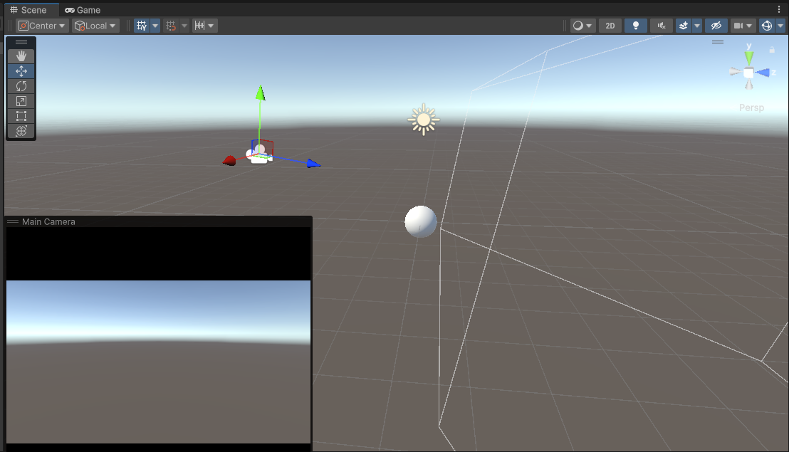

# Seminario 3: Mundos Virtuales

* Hugo Hernández Martín
* José Ramón Morera Campos
* Pablo Santana González

---

1. Qué funciones se pueden usar en los scripts de Unity para llevar a cabo traslaciones, rotaciones y escalados.

    * Para llevar a cabo todas las modificaciones mencionadas, se trabajará sobre el componente ***Transform*** del ***GameObject***. 

    1. Traslaciones:
        -  Modificar directamente el atributo `transform.position`.
        - Usar método ***transform.Translate***.
    2. Rotaciones:
        -  Modificar directamente el atributo `transform.rotation`.
        - Usar método ***transform.Rotate***.
        - Usar método ***transform.RotateAround***.
    3. Escalado:
        - Modificar directamente el atributo `transform.localScale`.

2. Como trasladarías la cámara 2 metros en cada uno de los ejes y luego la rotas 30º alrededor del eje Y?. Rota la cámara alrededor del eje Y 30ª y desplázala 2 metros en cada uno de los ejes. ¿Obtendrías el mismo resultado en ambos casos?. Justifica el resultado

    * Se pueden ver los scripts utilizados en `scripts/Ejercicio2-1.cs` y `scripts/Ejercicio2-2.cs`
    * No se obtiene el mismo resultado. Si nos fijamos en las siguientes imágenes, veremos que en el inspector las posiciones son diferentes. Esto se debe a que el orden de las operaciones sobre los objetos es importante. De manera informal, no es lo mismo girar a la derecha y luego dar dos pasos, que dar dos pasos y girar a la derecha.
  
    * 
    *  

3. Sitúa la esfera de radio 1 en el campo de visión de la cámara y configura un volumen de vista que la recorte parcialmente.

    * Se ha modificado el plano near, de forma que corte la esfera en la parte más cercana a la cámara, ya que, es esta forma, se ve mayor diferencia.

    * 

    * 

4. Sitúa la esfera de radio 1 en el campo de visión de la cámara y configura el volumen de vista para que la deje fuera de la vista.
    * Se ha modificado el plano near, de forma que queda más allá de la esfera. Por eso esta no se renderiza.

    * 

    * 

5. Como puedes aumentar el ángulo de la cámara. Qué efecto tiene disminuir el ángulo de la cámara.

    * Para modificar el ángulo de la cámara se modificará el parámetro ***Field Of View (FOV)*** de la misma en el inspector mientras la cámara está seleccionada. 

    * Al disminuir el ***FOV*** de la cámara se realiza un "zoom", perdiendo campo de visión y acercando los objetos que quedan en el mismo.

6. Es correcta la siguiente afirmación: Para realizar la proyección al espacio 2D, en el inspector de la cámara, cambiaremos el valor de projection, asignándole el valor de orthographic

    * Depende. Toda las proyecciones que realizamos para visualizar en una pantalla son proyecciones al espacio 2D. Sin embargo, si nos referimos a una proyección al espacio 2D en la que los objetos están en un espacio 2D, es decir, en la misma profundidad, necesitamos usar la proyección ortográfica.

7. Especifica las rotaciones que se han indicado en los ejercicios previos con la utilidad quaternion.

    * [Script act 2.1 con cuaterniones.](./scripts/Ejercicio7-1.cs)
    * [Script act 2.2 con cuaterniones.](./scripts/Ejercicio7-2.cs)

8. ¿Como puedes averiguar la matriz de proyección en perspectiva que se ha usado para proyectar la escena al último frame renderizado?.
   * Utilizando `Camera.previousViewProjectionMatrix` obtendremos la matriz de proyección utilizada en el último frame renderizado, tanto para la perspectiva como para ortográfica.

9. ¿Como puedes averiguar la matriz de proyección en perspectiva ortográfica que se ha usado para proyectar la escena al último frame renderizado?.
   * Utilizando `Camera.previousViewProjectionMatrix` obtendremos la matriz de proyección utilizada en el último frame renderizado, tanto para la perspectiva como para ortográfica.

10. ¿Cómo puedes obtener la matriz de transformación entre el sistema de coordenadas local y el mundial?.
   * Utilizando la propiedad `Transform.localToWorldMatrix` sobre el `transform` del objeto (sistema de coordenadas local).

11. Cómo puedes obtener la matriz para cambiar al sistema de referencia de vista.

    * Para obtener la matriz solicitada se hará uso del siguiente script: [Script obtención de matriz de cambio de sistema de referencia de la vista](./scripts/Ejercicio11-1.cs).

12. Especifica la matriz de la proyección usado en un instante de la ejecución del ejercicio 1 de la práctica 1.

13. Especifica la matriz de modelo y vista de la escena del ejercicio 1 de la práctica 1.

14. Aplica una rotación en el start de uno de los objetos de la escena y muestra la matriz de cambio al sistema de referencias mundial.

15. ¿Como puedes calcular las coordenadas del sistema de referencia de un objeto con las siguientes propiedades del Transform:?: 
Position (3, 1, 1), Rotation (45, 0, 45)

16. Investiga sobre los modelo de iluminación que aplica Unity y resume las relaciones existentes con el modelo explicado en clase.
* Iluminación Ambiente (Ambient Light):
En Unity, la luz ambiental (ambient light) se trata de una  una luz uniforme que afecta a todos los objetos sin importar su posición o orientación. Proporcionando iluminación base en toda la escena.

* Iluminación Difusa (Diffuse Lighting):
En Unity, los materiales PBR y las luces como Directional Light y Point Light emplean este modelo para simular cómo la luz se esparce sobre las superficies, logrando efectos realistas.
* Iluminación Especular (Specular Lighting):
Unity incluye esta iluminación en su modelo PBR y se ajusta usando el parámetro de Smoothness en los materiales, que controla la intensidad del brillo. Este brillo depende del observador, la fuente y la posición del objeto, como en el modelo del documento.
  

18. Indica las funciones de la API de Unity más importantes respecto a la iluminación
    
En Unity, la API de iluminación está dividida en varias clases con múltiples funciones relevantes:

   * Light Class: Permite controlar el tipo de luz (direccional, puntual, spot, área), su intensidad (Light.intensity), color (Light.color), y rango (Light.range). También se puede ajustar el ángulo de la luz spot (Light.spotAngle) y el tipo de sombras proyectadas (Light.shadows).

   * RenderSettings Class: Controla la luz ambiental (RenderSettings.ambientLight), la intensidad de reflejos (RenderSettings.reflectionIntensity), y el material del cielo (RenderSettings.skybox).
